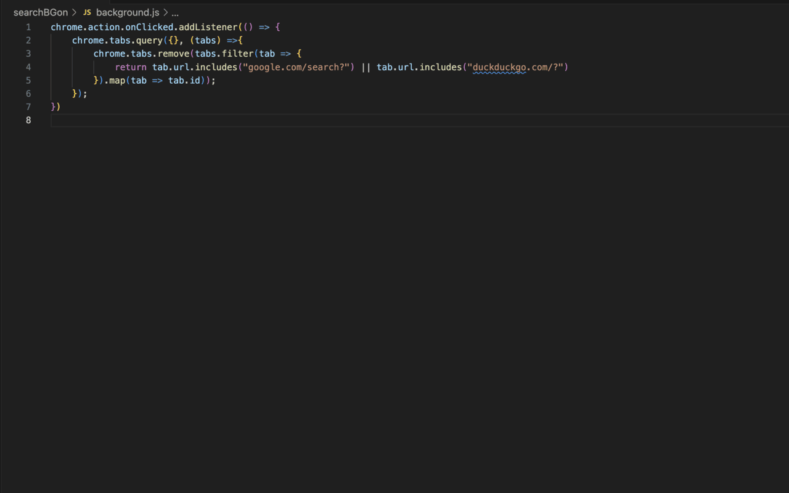

# SearchBGon

A Chrome extension that closes all search engine tabs with one click (or `Ctrl+Shift+Z`).

## Supported Search Engines

- Google
- DuckDuckGo
- Bing
- Yahoo
- Brave Search
- Ecosia
- Startpage
- Kagi

## Features

- **One-click cleanup** — click the icon or press `Ctrl+Shift+Z` to close all search tabs
- **Badge counter** — shows the number of open search tabs on the extension icon
- **Lightweight** — no permissions beyond `tabs`, no background overhead

## Install

1. Clone this repo or download the source
2. Open `chrome://extensions`
3. Enable **Developer mode**
4. Click **Load unpacked** and select this directory

## License

See [LICENSE](LICENSE).
